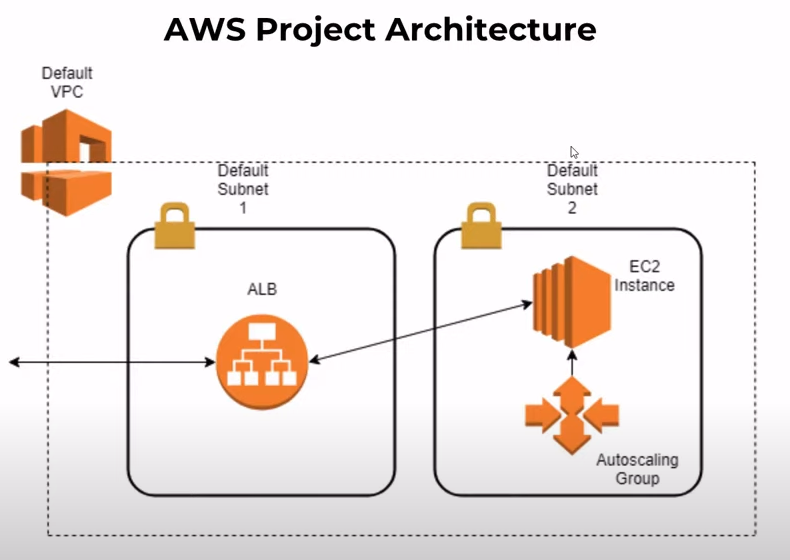
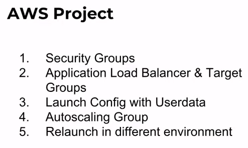

Docs: https://www.terraform.io/
Install: https://learn.hashicorp.com/tutorials/terraform/install-cli

# Create a simpe terraform template to create 

## Command:

- terraform workspace new staging
- terraform init
- terraform fmt --recursive (Format code)
- terraform plan
- terraform apply
